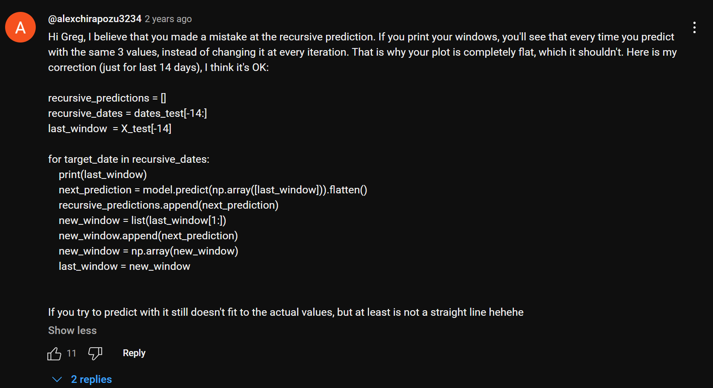

Todo-1: We will Collect the Stock Data-- NABIL DONE
TASK 2: Preprocess the Data - Train and Test DONE
TASK 3: Create an stacked LSTM model 
TASK 4: Predict the test data and plot the output
TASK 5: Predict the future 30 days and plot the output
TASK 6: Comparision between the predicted future 30 days data and real data after 30 days
TASK 7: User Interface

Recursive error: 

Important Things to remember:

1. Setting Date as an Index

Definition: The date becomes the index of the DataFrame.
Auto-Sorting: Automatically sorts the data chronologically.

Plotting:
When using libraries like Matplotlib or Pandas' built-in plotting functions, the date index is automatically used as the x-axis.
Ideal for time-series visualizations since it reflects the time order directly.

Advantages:
Cleaner syntax for slicing and filtering.
Better suited for time-series models that require data sorted by time.

Disadvantages:
If the dataset has multiple entries for the same date (e.g., stock data with timestamps), you may lose information unless the index is made unique.

2. Keeping Date as a Normal Datetime Column
   Definition: The date remains a standard column in the DataFrame.

Implications:
Flexibility: Easier to combine with other datasets or use multiple columns for analysis.

Plotting:
You need to explicitly specify the date column as the x-axis when plotting (e.g., plt.plot(data['date'], data['value'])).
just plotting ma date important hudaina, tesma user garna faida hunxa

Advantages:
aru dataset sanga merger, concatination garna sajilo

Disadvantages:
Difficult in date slicing and filtering
May require additional steps to ensure plots are time-aware.
